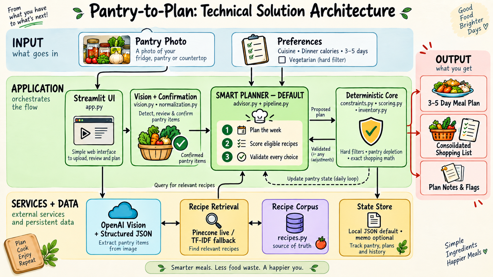

# Pantry to Plan

Turn a pantry photo into a 3 to 5 day dinner plan and a consolidated shopping
list. This is a five-hour prototype: one contiguous, demoable pipeline, with
any complexity that does not prove the core loop cut rather than deferred.

Full spec: [Pantry to Plan PRD](https://docs.google.com/document/d/1tc3IKXzLXF_MYZABZueAzt01adY4Mr-4/edit)

## Goal

Prove that vision parsing, recipe retrieval, deterministic scoring, an optional
hard vegetarian filter, pantry depletion, and shopping-list aggregation can work
as one understandable flow within a five-hour build window.

```
pantry photo  ->  preferences + vegetarian gate  ->  meal plan  ->  shopping list
```


*Figure 1: End to end product experience.*

## What the demo shows

1. Upload a pantry photo, see a parsed ingredient list.
2. Pick a cuisine preference, a daily calorie target, and optionally require
   vegetarian recipes.
3. Get a 3 to 5 day plan where each day's recipe roughly matches the cuisine,
   roughly hits the calorie target, is vegetarian whenever that hard constraint
   is enabled, and prefers ingredients already on hand.
4. See a shopping list of what is missing across the plan.

## Architecture



*Figure 2: Technical solution architecture and daily planning loop.*

- **OpenAI (GPT-4o)** handles image understanding, structured/JSON output, and
  query embeddings (`text-embedding-3-small`).
- **Pinecone** stores the recipe corpus and retrieves a small candidate set per
  day, applying the `vegetarian=true` metadata filter when requested. Pinecone's
  job is recall; the local recipe corpus is the source of truth for exact
  ingredients and quantities.
- **Python** enforces the vegetarian gate again, applies exact scoring rules,
  and updates pantry state.
- **Persistence** (pantry state, generated day plans) goes through a thin
  `memory.py` interface so the storage choice stays isolated. Default to a local
  JSON file unless mem0 is explicitly a requirement to demo; either way the rest
  of the code only calls `save_pantry`, `update_pantry`, `append_day_plan`,
  `load_pantry`, `load_day_plans`. The recipe corpus lives in Pinecone, kept
  separate from the "what is true now / what happened" store.

## The daily loop

A simple for-loop over 3 to 5 days. No retries, no relax loop, just best-match.

For each day:
1. Build a query from the current pantry plus cuisine preference, embed it, and
   query Pinecone (top-k). When vegetarian is required, apply the metadata
   filter.
2. Discard any non-vegetarian candidate when the hard constraint is on, then
   score the eligible candidates in Python on: cuisine match (in/out), calorie
   distance from target, percentage of ingredients already in the pantry, and
   not already used this week.
3. Sample one candidate from the eligible set, weighted by score (see
   [Selection](#selection) below), so re-running the same pantry gives varied
   plans that still favor the best matches. If nothing eligible matches the
   cuisine, fall back to the closest calorie match and flag it. There is no
   substitution logic, just a flag. Never fall back to a non-vegetarian recipe.
4. Subtract the recipe's ingredients from the in-memory pantry, persist the
   updated state, and append the `DayPlan`.

Then aggregate: the list of `DayPlan`s plus a shopping list (sum of all recipe
ingredients minus the final pantry state), and report which days missed a
constraint and by how much.

## Constraints

- **Cuisine**: one or more tags from a fixed list of four (`italian`,
  `american`, `chinese`, `indian`), matching the corpus tags exactly. A recipe
  either matches or it does not, no fuzzy reasoning.
- **Calories**: one `dinner_calorie_target` plus a tolerance band derived from
  the request `goal` (`general` +/- 150, `nutritional` +/- 75, `kids` +/- 200
  kcal). One recipe equals one day's dinner; the target is for that single meal,
  not a full day's macros.
- **Vegetarian (optional hard gate)**: a `vegetarian_required` boolean. When on,
  only recipes tagged vegetarian are eligible, enforced as a Pinecone metadata
  filter and again in Python before scoring. It is never relaxed or downgraded
  to a warning. If no eligible recipe remains, return fewer days and clearly
  report that the hard constraint prevented completion.

Cut for time (easy to bolt on later as more filter predicates): protein/carb/fat
targets, allergies, per-meal dietary constraints, per-day target variation.

## Selection

The per-day pick is probabilistic by default. Among the candidates that already
passed the hard constraints (vegetarian gate, requested cuisine, not yet used),
the planner samples one with probability proportional to
`exp(total_score / T)`, where `T` is `config.SELECTION_TEMPERATURE` (default
`0.10`, overridable via the `SELECTION_TEMPERATURE` env var). The best-scoring
recipes are still the most likely, but the same pantry yields different plans on
re-runs instead of the identical list every time.

Only the choice among already-eligible candidates is randomized; scoring,
arithmetic, the vegetarian gate, cuisine scope, calorie-band flagging, and
pantry depletion stay fully deterministic. Reproducibility is preserved for
evals and demos two ways: pass `generate_plan(..., temperature=0)` to collapse
to the deterministic tie-break (argmax), or pass a seeded
`generate_plan(..., rng=random.Random(seed))` so a given seed always yields the
same plan. The eval and invariant tests use `temperature=0`; a dedicated test
class exercises the sampled path across many seeds and confirms no hard
constraint is ever violated.

## Data model

See [schemas.py](schemas.py) (Pydantic models, frozen shared contracts per the
implementation blueprint): `PantryItem`, `PantryParseResult`, `PantryState`,
`PlanningRequest`, `Recipe`, `RecipeIngredient`, `RecipeCandidate`,
`CandidateScore`, `EligibilityResult`, `DayPlan`, `Shortage`,
`ShoppingListItem`, `AppIssue`, `PlanResult`, and the eval types
(`CaseEvaluation`, `EvaluationSummary`). Everything is normalized to grams; unit
conversion is out of scope. Ingredient ids are lowercase snake_case (e.g.
`chicken_breast`) and are the join key across pantry, recipes, and shopping
list.

## Repository layout

Current state:

Module ownership follows the implementation blueprint (P1 vision/schemas, P2
corpus/retrieval, P3 planner/inventory, P4 UI/evals).

| File | Purpose | Owner | Status |
|---|---|---|---|
| [schemas.py](schemas.py) | Core Pydantic contracts | P1 | done |
| [config.py](config.py) | Score weights, goal->band mapping, settings | shared | done |
| [recipes.py](recipes.py) | 40-recipe corpus, 10 per cuisine, >=4 vegetarian each | P2 | done |
| [repository.py](repository.py) | Recipe corpus loading + id lookup | shared | done |
| [generate_fixtures.py](generate_fixtures.py) | Builds eval fixtures from the corpus | P4 | done |
| [fixtures/](fixtures/) | 23 eval scenarios (see [fixtures/README.md](fixtures/README.md)) | P1/P4 | done |
| [constraints.py](constraints.py) | Hard eligibility (vegetarian gate) | P3 | done |
| [scoring.py](scoring.py) | Score components + stable tie-break | P3 | done |
| [inventory.py](inventory.py) | Pantry depletion + shopping-list reconciliation | P3 | done |
| [pipeline.py](pipeline.py) | Fixed N-day loop + aggregation | P3 | done |
| [tests/](tests/) | Planner invariant + scenario tests | P3 | done |
| `vision.py` | OpenAI vision call -> `PantryParseResult` | P1 | todo |
| `normalization.py` | Aliases -> canonical ingredient ids | P1 | todo |
| `retrieval.py` | Retriever protocol + local/Pinecone adapters | P2 | todo |
| `explanations.py` | Evidence -> grounded reason text | P4 | todo |
| `app.py` | Streamlit UI | P4 | todo |
| `evals/run_eval.py` | Fixture suite -> `EvaluationSummary` | P4 | todo |

The PRD calls for `recipes.json`; this repo uses [recipes.py](recipes.py)
instead (typed `Recipe` objects, directly importable, no parse step). The
retrieval index-build reads from it and writes the Pinecone metadata
(`cuisine_tags`, `calories_per_serving`, `vegetarian`).

## Eval

Automated checks that the loop does what it claims, run against fixed fixtures
directly against `planner.py` (no subprocess, no live vision call), so they are
cheap to run repeatedly. The [fixtures/](fixtures/) folder holds 23 scenarios
covering the four required cases (well-stocked vegetarian, sparse pantry with
fallback, tight calorie band, vegetarian exhaustion) plus happy paths, join
mismatches, sizing edges, and vision-noise cases with unclear or poorly-labeled
pantry items.

Planned assertions (mechanical, not subjective):
- Every planned day produces exactly one `DayPlan`; a short plan is allowed only
  when a hard constraint leaves no unused recipe, and the reason is reported.
- With `vegetarian_required=True`, every selected recipe is vegetarian.
- `cuisine_match` agrees with any requested cuisine being in `recipe.cuisine_tags`.
- `calorie_delta` equals `recipe.calories_per_serving - dinner_calorie_target`
  exactly.
- Pantry never goes negative across day mutations.
- The final shopping list lists only ingredients still short, with
  `quantity_g > 0`.

## Build order

1. **Corpus + schemas** (done): unblocks everything, no dependencies.
2. **Vision parse**: one OpenAI call, image in, structured JSON out. Highest
   risk, do it early against 1 to 2 real photos.
3. **Retrieval**: build the Pinecone index, upsert the corpus, write the per-day
   query with the vegetarian metadata filter. Test standalone first.
4. **Planner**: day loop against a fake pantry first, then wire in real vision
   output and persistence. Confirm pantry depletion actually changes choices
   across days.
5. **Shopping-list diff, eval, CLI**: get the eval script working before
   polishing the CLI; the eval is what proves the demo works.

## Person 2: indexing and retrieval

Requires Python 3.10 or newer. Install dependencies with `uv sync --python 3.12`.

Build the local TF-IDF index (no API access or credentials needed):

```bash
uv run python index_recipes.py --backend local
```

Build the Pinecone index explicitly after creating an index whose dimension
matches `OPENAI_EMBEDDING_DIMENSIONS` (default 512):

```bash
uv run python index_recipes.py --backend pinecone
```

The cloud setup command loads `.env` and requires `OPENAI_API_KEY`,
`PINECONE_API_KEY`, and `PINECONE_INDEX_NAME`. Recipe embeddings are cached under
`.embeddings_cache/openai/`, keyed by recipe text, embedding model, and dimensions.
Repeated setup reuses those vectors and upserts current recipe metadata.

Set `RETRIEVAL_BACKEND=local` to force offline retrieval. Local retrieval never
calls cloud indexing, even with credentials configured. The factory also falls
back locally when cloud initialization fails; query-time failures are still
reported to the caller. Both backends use
`search(pantry, request, top_k)` and exclude non-vegetarian recipes when required.
Pinecone queries apply the vegetarian metadata filter and reject unknown IDs.
Cuisine mismatches remain candidates for the planner's explicit fallback.

Run the planner and retrieval tests without live API calls:

```bash
uv run python -m unittest discover -s tests
```

Run retrieval directly with the included vegetarian Italian pantry fixture:

```bash
uv run python retrieval.py --backend local
uv run python retrieval.py --backend pinecone
```

Use `--top-k 8` to change the result count or `--fixture fixtures/03_tight_band_indian.json`
to use another fixture. The CLI loads `.env` and prints recipe IDs, titles,
retrieval scores, and vegetarian status. Explicit Pinecone mode reports cloud
errors instead of silently switching backends.
