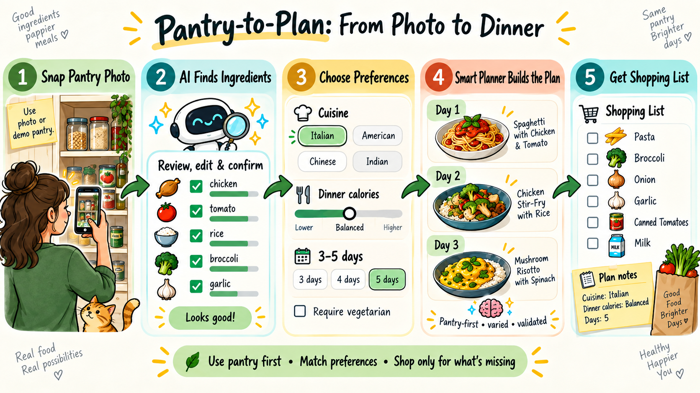

# Pantry to Plan

Turn a pantry photo into a 3 to 5 day dinner plan and a consolidated shopping
list. The application combines image-based ingredient detection, a human review
step, preference-aware recipe planning, pantry depletion, and shopping-list
aggregation in one Streamlit workflow.

Full spec: [Pantry to Plan PRD](https://docs.google.com/document/d/1tc3IKXzLXF_MYZABZueAzt01adY4Mr-4/edit)

## Goal

Provide an understandable end-to-end flow that combines vision parsing, recipe
retrieval, deterministic scoring, an optional hard vegetarian filter, pantry
depletion, and shopping-list aggregation.

```
pantry photo  ->  preferences + vegetarian gate  ->  meal plan  ->  shopping list
```



*Figure 1: End to end product experience.*

## What the demo shows

1. Upload a pantry photo, see a parsed ingredient list.
2. Pick a cuisine preference, a daily calorie target, and optionally require
   vegetarian recipes.
3. Get a 3 to 5 day plan where each day's recipe roughly matches the cuisine,
   roughly hits the calorie target, is vegetarian whenever that hard constraint
   is enabled, and prefers ingredients already on hand. Recipe cards use the
   matching image from `images/` and provide expandable ingredients and cooking
   instructions.
4. See a consolidated shopping list of what is missing across the plan.

## Running the UI

Requires Python 3.11 or newer. The recommended setup uses
[uv](https://docs.astral.sh/uv/):

```bash
uv sync
uv run streamlit run app.py
```

Alternatively, use a standard virtual environment:

```bash
python3 -m venv .venv
.venv/bin/pip install -r requirements.txt
.venv/bin/streamlit run app.py
```

The UI ([app.py](app.py)) is a four-step Streamlit wizard: upload a pantry photo
(or click "Use the demo pantry"), confirm and adjust the parsed items, set
preferences, then view a day-by-day plan and shopping list. The interface uses
the visual assets in `assets/ui/` and recipe images in `images/`. Non-widget
application logic lives in [app_services.py](app_services.py); Streamlit holds
the current pantry and plan in session state. Preferences load from
`preferences.default.json` and persist to `preferences.json` (gitignored) when
changed.

The confirm step is a human-in-the-loop review table: each detected item has an **Include** toggle
(checked by default, only checked rows are planned), editable name / canonical ID
/ quantity, and read-only signals from the vision + normalization pass:
**Confidence** as a bar, the **Detected label**, the **Mapping** status (exact /
alias / unmapped). A "double-check these" banner recomputes live from the table
(low confidence or missing quantity), and an "Add an ingredient manually"
control normalizes typed names into the corpus vocabulary. Vegetarian is off by
default; enable it in the Preferences step to apply the hard gate.

Retrieval is live: [app_services.py](app_services.py) `get_retriever()` calls
`retrieval.create_retriever()`, which defaults to `auto` (query Pinecone when
`OPENAI_API_KEY` / `PINECONE_API_KEY` / `PINECONE_INDEX_NAME` are set and the
index is built, otherwise TF-IDF local). Set `RETRIEVAL_BACKEND=local` to force
the offline path. The photo step is wired to [vision.py](vision.py): with
`OPENAI_API_KEY` set it runs the live vision parse, and without a key (or if
vision.py is absent) it falls back to the bundled demo pantry so the wizard stays
runnable end to end. When `OPENAI_API_KEY` is available, the UI also offers an
**Agent + MCP planner**. One planning agent discovers and chooses grounded MCP
tools, observes their results, simulates a week, and must obtain deterministic
final approval. If the model or MCP session fails, the same request
automatically runs through the standard planner and is marked as a fallback.

## Architecture

- **OpenAI (GPT-4o)** handles image understanding, structured/JSON output, and
  query embeddings (`text-embedding-3-small`).
- **Pinecone** stores the recipe corpus and retrieves a small candidate set per
  day, applying the `vegetarian=true` metadata filter when requested. Pinecone's
  job is recall; the local recipe corpus is the source of truth for exact
  ingredients and quantities.
- **Python** enforces the vegetarian gate again, applies exact scoring rules,
  and updates pantry state.
- **State management** keeps the current pantry and generated plan in Streamlit
  session state for the active browser session. User preferences are the only
  application data persisted locally, in the gitignored `preferences.json`.
  The typed recipe corpus in [recipes.py](recipes.py) remains the source of truth
  for recipe details regardless of retrieval backend.

## The daily loop

The default planner uses a simple for-loop over 3 to 5 days with no retries or
relaxation loop. When smart planning is enabled, the optional advisor can use
the bounded whole-week and relax-and-repair strategies described in
[Agentic planning](#agentic-planning-opt-in).

For each day:
1. Build a query from the current pantry plus cuisine preference, embed it, and
   query Pinecone (top-k). When vegetarian is required, apply the metadata
   filter.
2. Discard any non-vegetarian candidate when the hard constraint is on, then
   score the eligible candidates in Python on: cuisine match (in/out), calorie
   distance from target, percentage of ingredients already in the pantry, and
   not already used this week.
3. Sample one candidate from the eligible set, weighted by score (see
   [Selection](#selection) below), so re-running the same pantry gives varied
   plans that still favor the best matches. If nothing eligible matches the
   cuisine, fall back to the closest calorie match and flag it. There is no
   substitution logic, just a flag. Never fall back to a non-vegetarian recipe.
4. Subtract the recipe's ingredients from the in-memory pantry and append the
   `DayPlan` to the current result.

Then aggregate: the list of `DayPlan`s plus a shopping list (sum of all recipe
ingredients minus the final pantry state), and report which days missed a
constraint and by how much.

## Constraints

- **Cuisine**: one or more tags from a fixed list of four (`italian`,
  `american`, `chinese`, `indian`), matching the corpus tags exactly. A recipe
  either matches or it does not, no fuzzy reasoning.
- **Calories**: one `dinner_calorie_target` plus a tolerance band derived from
  the request `goal` (`general` +/- 150, `nutritional` +/- 75, `kids` +/- 200
  kcal). One recipe equals one day's dinner; the target is for that single meal,
  not a full day's macros.
- **Vegetarian (optional hard gate)**: a `vegetarian_required` boolean. When on,
  only recipes tagged vegetarian are eligible, enforced as a Pinecone metadata
  filter and again in Python before scoring. It is never relaxed or downgraded
  to a warning. If no eligible recipe remains, return fewer days and clearly
  report that the hard constraint prevented completion.

Cut for time (easy to bolt on later as more filter predicates): protein/carb/fat
targets, allergies, per-meal dietary constraints, per-day target variation.

## Selection

The per-day pick is probabilistic by default. Among the candidates that already
passed the hard constraints (vegetarian gate, requested cuisine, not yet used),
the planner samples one with probability proportional to
`exp(total_score / T)`, where `T` is `config.SELECTION_TEMPERATURE` (default
`0.10`, overridable via the `SELECTION_TEMPERATURE` env var). The best-scoring
recipes are still the most likely, but the same pantry yields different plans on
re-runs instead of the identical list every time.

Only the choice among already-eligible candidates is randomized; scoring,
arithmetic, the vegetarian gate, cuisine scope, calorie-band flagging, and
pantry depletion stay fully deterministic. Reproducibility is preserved for
evals and demos two ways: pass `generate_plan(..., temperature=0)` to collapse
to the deterministic tie-break (argmax), or pass a seeded
`generate_plan(..., rng=random.Random(seed))` so a given seed always yields the
same plan. The eval and invariant tests use `temperature=0`; a dedicated test
class exercises the sampled path across many seeds and confirms no hard
constraint is ever violated.

## Agentic planning (opt-in)

Two optional strategies let a model shape the plan without ever touching the
arithmetic. They activate only when a `PlannerAdvisor` is injected into
`generate_plan(..., advisor=...)`; with no advisor the default greedy loop above
runs unchanged. The governing rule is **agent proposes, deterministic core
disposes**: the advisor only decides *what to try*, while scoring, eligibility,
the vegetarian gate, depletion, and shopping-list reconciliation stay in
deterministic Python.

- **Whole-week planning**: the advisor proposes an ordered week from the scored
  candidate pool, optimizing cross-day goals (minimize the shopping list, deplete
  the pantry smartly, keep variety). The core then validates every proposed
  recipe (unknown id, repeat, or vegetarian violation is dropped) and
  materializes it, so no proposal can break an invariant.
- **Relax-and-repair**: when a day cannot be filled, the advisor picks one
  relaxation from a fixed menu (`ALLOW_REPEAT`, `CROSS_CUISINE`, `GIVE_UP`) and
  the core applies it deterministically. Crossing cuisines is a flagged last
  resort. The loop is bounded by `config.MAX_RELAXATION_ROUNDS`, and the
  vegetarian gate is never on the menu, so it is never relaxed.

The real advisor ([advisor.py](advisor.py) `OpenAIPlannerAdvisor`) calls
OpenAI with structured output; tests and evals inject `FakePlannerAdvisor`, a
deterministic double, so the agentic path is reproducible with no API key. Every
agent decision is surfaced through `PlanResult.trace`, `PlanResult.warnings`, and
`DayPlan.flags`.

## Single agent + MCP planning

The `mcp_agent` mode is a tool-use loop rather than a fixed sequence of model
calls. `mcp_planner_agent.py` gives one model the planning goal and tool schemas
discovered from `meal_tools_server.py`. The model chooses the next tool and its
arguments, receives the observation, and may revise its proposal. The
controller bounds this autonomy to 12 tool calls, two rejected-plan revisions,
and 30 seconds by default.

| MCP tool | Deterministic implementation |
|---|---|
| `search_recipes` | `retrieval.py` (Pinecone/OpenAI or local TF-IDF) |
| `get_recipe_details` | `repository.py` trusted corpus lookup |
| `evaluate_candidates` | `constraints.py` and `scoring.py` |
| `simulate_plan` | `pipeline.py` and `inventory.py` |
| `validate_final_plan` | Mandatory corpus, constraint, depletion, and shopping-list gate |

The model never supplies recipe facts, scores, quantities, or shopping-list
arithmetic. It chooses what to investigate and which grounded IDs to propose.
The Streamlit result page displays the mode, tool trajectory, revision count,
validator outcome, and a score-grounded explanation for each meal.

The local stdio MCP server is launched automatically by the client; no second
terminal is required:

### Recommended live-demo configuration

The default agent limits are intentionally conservative. For a live OpenAI
agent run, the following settings were tested successfully:

```bash
export OPENAI_API_KEY="..."
export MCP_AGENT_ENABLED=true
export MCP_AGENT_TOTAL_TIMEOUT_SECONDS=120
export MCP_TOOL_TIMEOUT_SECONDS=30
export MCP_MAX_TOOL_CALLS=15
export MCP_MAX_PLAN_REVISIONS=3

uv run streamlit run app.py

```


## Data model

See [schemas.py](schemas.py) (strict Pydantic models shared across modules):
`PantryItemCandidate`, `PantryItem`, `PantryParseResult`, `PantryState`,
`PlanningRequest`, `Recipe`, `RecipeIngredient`, `RecipeCandidate`,
`CandidateScore`, `EligibilityResult`, `DayPlan`, `Shortage`,
`ShoppingListItem`, `AppIssue`, `PlanResult`, and the eval types
(`CaseEvaluation`, `EvaluationSummary`). Everything is normalized to grams; unit
conversion is out of scope. Ingredient ids are lowercase snake_case (e.g.
`chicken_breast`) and are the join key across pantry, recipes, and shopping
list. The local recognition catalog currently contains 205 canonical IDs: all
96 recipe ingredient IDs plus 109 commonly encountered foods.
`PantryItemCandidate` is machine-proposed vision output;
`PantryItem` inside `PantryState` is user-confirmed planner input. Models reject
unknown fields and enforce quantity, confidence, coverage, day, and identifier
bounds at module boundaries.

## Repository layout

| Path | Purpose |
|---|---|
| [app.py](app.py) | Redesigned Streamlit wizard, recipe cards, and shopping-list UI |
| [app_services.py](app_services.py) | UI-supporting preference, pantry, retrieval, and planning logic |
| [assets/ui/](assets/ui/) | Decorative interface assets used across the wizard |
| [images/](images/) | Recipe images, named to match recipe titles |
| [schemas.py](schemas.py) | Shared strict Pydantic contracts |
| [config.py](config.py) | Score weights, goal-to-band mapping, and settings |
| [recipes.py](recipes.py) | 40-recipe typed corpus with ingredients and cooking instructions |
| [repository.py](repository.py) | Recipe corpus loading and ID lookup |
| [constraints.py](constraints.py) | Hard eligibility rules, including the vegetarian gate |
| [scoring.py](scoring.py) | Score components, stable tie-break, and softmax selection |
| [inventory.py](inventory.py) | Pantry depletion and shopping-list reconciliation |
| [pipeline.py](pipeline.py) | Default and agent-assisted planning strategies plus aggregation |
| [advisor.py](advisor.py) | Optional LLM planning advisor and deterministic test double |
| [mcp_planner_agent.py](mcp_planner_agent.py) | Bounded single-agent MCP tool-selection loop |
| [meal_tools_server.py](meal_tools_server.py) | Local MCP server exposing five grounded planning tools |
| [meal_tools_client.py](meal_tools_client.py) | Stdio MCP discovery and invocation client |
| [mcp_models.py](mcp_models.py) | Typed MCP, tool, and agent-turn contracts |
| [vision.py](vision.py) | Validated image detection producing `PantryParseResult` |
| [normalization.py](normalization.py) | Raw labels mapped to corpus-backed ingredient IDs |
| [retrieval.py](retrieval.py) | Retriever protocol with Pinecone (OpenAI embeddings) and TF-IDF local adapters |
| [index_recipes.py](index_recipes.py) | Corpus validation, Pinecone indexing, and TF-IDF local index build |
| [fixtures/](fixtures/) | 23 evaluation scenarios; see [fixtures/README.md](fixtures/README.md) |
| [generate_fixtures.py](generate_fixtures.py) | Regenerates evaluation fixtures from the corpus |
| [tests/](tests/) | Planner, retrieval, scenario, vision, UI-service, and schema tests |

The PRD calls for `recipes.json`; this repo uses [recipes.py](recipes.py)
instead (typed `Recipe` objects, directly importable, no parse step). The
retrieval index-build reads from it and writes the Pinecone metadata
(`cuisine_tags`, `calories_per_serving`, `vegetarian`).

## Eval

Automated checks that the loop does what it claims, run against fixed fixtures
directly against `pipeline.py` (no subprocess, no live vision call), so they are
cheap to run repeatedly. The [fixtures/](fixtures/) folder holds 23 scenarios
covering the four required cases (well-stocked vegetarian, sparse pantry with
fallback, tight calorie band, vegetarian exhaustion) plus happy paths, join
mismatches, sizing edges, and vision-noise cases with unclear or poorly-labeled
pantry items.

The suite verifies mechanical invariants rather than subjective recipe quality:
- Every planned day produces exactly one `DayPlan`; a short plan is allowed only
  when a hard constraint leaves no unused recipe, and the reason is reported.
- With `vegetarian_required=True`, every selected recipe is vegetarian.
- `cuisine_match` agrees with any requested cuisine being in `recipe.cuisine_tags`.
- `calorie_delta` equals `recipe.calories_per_serving - dinner_calorie_target`
  exactly.
- Pantry never goes negative across day mutations.
- The final shopping list lists only ingredients still short, with
  `quantity_g > 0`.
- Schema contracts reject malformed IDs, invalid confidence values,
  contradictory eligibility results, and unexpected fields.

The LangSmith evaluation harness lives in [evaluation/](evaluation/). Its first
smoke workflow uploads Golden Dataset v1, filters to one case, and runs only
`PTP-001` with local TF-IDF retrieval, no advisor, and `temperature=0`:

```bash
export LANGSMITH_API_KEY="..."
uv run python -m evaluation.run_eval --case-id PTP-001 --mode deterministic --upload
```

See [evaluation/README.md](evaluation/README.md) for dataset immutability,
metrics, trace structure, and the local-only command.

Run the complete local suite from the repository root:

```bash
uv run python -m unittest discover -s tests -v
```

Run the reproducible 23-case MCP-agent evaluation over the real local stdio
transport (no OpenAI key required):

```bash
uv run python -m evaluation.run_mcp_agent_eval
```

## Indexing and retrieval (RAG)

Recipe recommendation is retrieval-augmented: rather than asking a model to
recall recipes, the app embeds each recipe once at index time, embeds the live
pantry-and-preferences query at plan time, and retrieves the nearest recipes by
vector similarity. The retrieved IDs are only candidates. Exact ingredients,
quantities, calories, and cuisine tags are always resolved from the typed corpus
in [recipes.py](recipes.py) via `repository.get_recipe()`, never inferred by the
model. This keeps recall smart while the numbers that drive scoring, depletion,
and the shopping list stay exact and deterministic.

### How the app uses it

[app.py](app.py) does not talk to a backend directly. Its planning step calls
[app_services.py](app_services.py) `get_retriever()`, which delegates to
`retrieval.create_retriever()` and defaults to the `auto` backend:

- **Pinecone (primary)**: when `OPENAI_API_KEY`, `PINECONE_API_KEY`, and
  `PINECONE_INDEX_NAME` are set (and the index is built), each day's query is
  embedded with OpenAI `text-embedding-3-small` and sent to Pinecone, which
  returns the top-k nearest recipes by cosine similarity. When vegetarian is
  required, a `vegetarian=true` metadata filter is applied in the query itself;
  cuisine mismatches are not dropped but down-weighted (score halved) so they
  remain available for the planner's explicit fallback.
- **TF-IDF local (fallback)**: with no credentials, or on any Pinecone
  initialization/search error, `auto` transparently falls back to an in-memory
  TF-IDF retriever over the same corpus, reports the fallback once, and stays
  local for the lifetime of that retriever. For the 40-recipe corpus this is
  fast, offline, and deterministic. Empty results and unknown recipe IDs do not
  trigger fallback.

Both backends expose the same `search(pantry, request, top_k)` interface and
exclude non-vegetarian recipes when required, so the planner is agnostic to
which one answered. Set `RETRIEVAL_BACKEND=local` to force offline retrieval
even when credentials are present, or `RETRIEVAL_BACKEND=pinecone` to require
the cloud path and surface errors instead of silently switching.

### Building the Pinecone index

Install dependencies with `uv sync`, then populate the index (this is what makes
the primary path usable; without it, `auto` stays on TF-IDF):

```bash
uv run python index_recipes.py --backend pinecone
```

This embeds each recipe with OpenAI `text-embedding-3-small` (client-side) and
upserts dense vectors, so the index must be a plain dense index whose dimension
matches `OPENAI_EMBEDDING_DIMENSIONS` (default 512), not a Pinecone
integrated/semantic index. The build manages that for you: it creates the index
if missing (dense, cosine, serverless; `PINECONE_CLOUD` / `PINECONE_REGION`
override the default `aws` / `us-east-1`), reuses it when it already exists at the
right dimension, and stops with a clear error if it exists at a different
dimension (for example a stale 1024-dim integrated index) rather than silently
producing an unqueryable index. To fix a flagged mismatch, delete and recreate
the index at the expected dimension, or set `OPENAI_EMBEDDING_DIMENSIONS` to match.

The build loads `.env` and requires `OPENAI_API_KEY`, `PINECONE_API_KEY`, and
`PINECONE_INDEX_NAME`. It upserts recipe metadata (`cuisine_tags`,
`calories_per_serving`, `vegetarian`) used for query-time filtering. Recipe
embeddings are cached under `.embeddings_cache/`, keyed by recipe text, embedding
model, and dimensions, so re-running reuses vectors and only re-upserts metadata.

The offline TF-IDF index needs no credentials and is built on demand the first
time the local retriever runs; you can also build it explicitly:

```bash
uv run python index_recipes.py --backend local
```

Run the planner and retrieval tests without live API calls:

```bash
uv run python -m unittest discover -s tests
```

## Vision

The photo step in [app.py](app.py) is wired to [vision.py](vision.py) through
[app_services.py](app_services.py) `parse_pantry_image()`. When `OPENAI_API_KEY`
is set it runs the live parse; without a key (or on a checkout missing
vision.py) it falls back to the bundled demo pantry so the wizard stays runnable
end to end. A hard vision failure is surfaced to the UI rather than swallowed.

The parse has three boundaries:

1. `OpenAIVisionProvider` (GPT-4o, override with `OPENAI_VISION_MODEL`) returns a
   `RawVisionResult` of detected labels with confidences.
2. `IngredientNormalizer` maps each raw label to the recipe-corpus vocabulary
   (exact / alias / unmapped), discovering its authoritative ingredient IDs from
   the corpus.
3. `parse_pantry_image` returns a `PantryParseResult`, which the confirm step
   renders as the human-in-the-loop review table before anything is planned.

Detections at or below `LOW_CONFIDENCE_THRESHOLD` (or missing a quantity) are
flagged for review on the confirm step. The vision parse never does recipe
recommendation, scoring, or inventory depletion; those stay deterministic and
downstream.

Common maintenance points:

- Add recognized foods to `data/ingredient_catalog.json`.
- Add semantic label mappings such as `capsicum -> bell_pepper` to
  `data/ingredient_aliases.json`.
- Add or change corpus ingredient IDs in `recipes.py`; the normalizer discovers
  its authoritative vocabulary from that corpus automatically.
- Tune `DEFAULT_LOW_CONFIDENCE` in `vision.py` to change which detections the UI
  asks the user to review.
- Keep recipe recommendation, scoring, and inventory depletion out of the
  vision prompt; those remain deterministic downstream responsibilities.

Recognition and recipe support are deliberately separate. For example,
`dragon_fruit` is a recognized catalog item and `pitaya` is one of its aliases,
but `recipe_supported` remains false until at least one recipe in `recipes.py`
uses `dragon_fruit`. An entirely unknown label is preserved with
`normalization_status="unmapped"` for correction in the confirmation UI.
